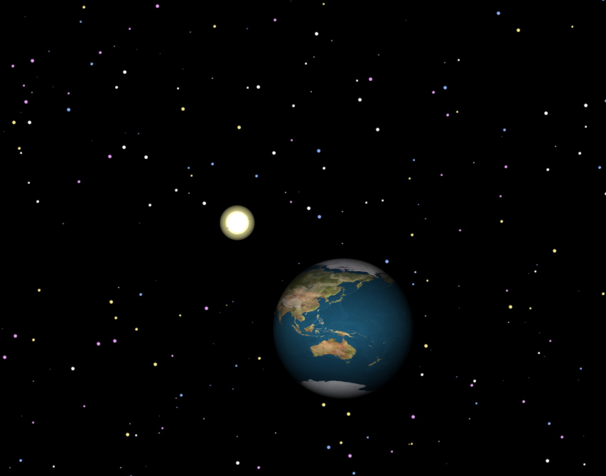

# solar-system
A 3d solar system using JavaFX

## Initial view
The first iteration (tag 1_0) has a sun and earth, with a rotation animation on the earth.

## Attribution
Planet textures are Copyright (c) by James Hastings-Trew, used in accordance with his usage statement:

http://planetpixelemporium.com/planets.html
